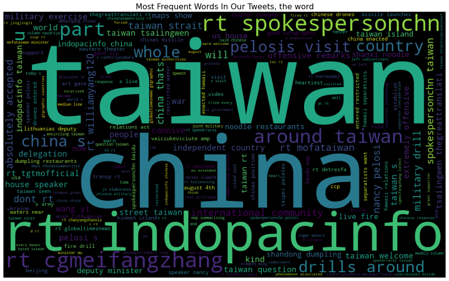

<<<<<<< HEAD
#Tweet Analysis of the China-Taiwan-US Current Political Situation

=======
# Tweet Analysis of the China-Taiwan-US Current Political Situation
>>>>>>> 07659044bbed2d82123239929c8efb05b540f3b7
An end to end Machine Learning project on Natural Language Processing to analyze data collected from tweets about the China-US- Taiwan situation; from collecting tweets to deploying results on the dashboard. The models explored here are topic modelling and sentiment 
 
##Business understanding.

The current China-US-Taiwan crisis has fueled a lot of tension in the affected countries which might significantly affect the economy. People doing business around China, the US, and Taiwan may be greatly affected. We can gauge how people around the world are feeling about it and in turn, give them insights to make better decisions about their business.

## Data understanding 
To do this analysis, Tweepy, a python library, allows developers to collect data based on certain topics and keywords, in a specific timeline. The data  was collected using the trending keywords: [‘chinaus’, ‘chinaTaiwan’,  ‘chinaTaiwancrisis’, ‘taiwan’, ‘XiJinping’, ‘USCHINA’, ‘pelosi’, ‘TaiwanStraitsCrisis’, ‘WWIII’,  ‘pelosivisittotaiwan’]. Two sets of data were collected, one from a global level and the other from specific African countries. (The need for this is to show the data drift in the ML model from a global view to a specific niche.) You can stream this data in real-time based on these keywords, and write python code, to interface with your end application.
From my analysis; 
our “global_twitter_data” had 22,000 tweets. None of the attributes has missing values, save for the “possibly_sensitive” attribute, which had 15,809 missing values. This indicates the number of tweets missing URLs in the tweets. 

 
 
 
Univariate analysis of the hashtags revealed the top 20 hashtags;
The top 10 user mentions on the tweets were;

          
Data preparation
Since the data collected from Twitter is unstructured, in the sense that it has different languages, emojis, etc. To fix this, we need code bases to clean the data and extract the Twitter data into the pandas dataframe. We also need to create unit tests to automatically test new codes on the code bases and integration tests for testing multiple units working together. After the data is loaded to the pandas dataframe, you will need to perform pre-processing to check for consistency, for example, ensure no missing values. This all ensures that your data is ready to be fed into the models. Feature stores are used to populate the data into databases like SQL for storage. 
Once the data is clean, 
 I performed analysis on the users like the number of users, and the ones with the most tweets interacted.

The frequency of the hottest tweets according to favorite count 

The devices used, whether android, web or IOS.

Modeling
Data visualization can then be done using platforms like Flask, and Streamlit, to show the different analyses of the data like the polarity, counts, teets likes, etc. This can be obtained by using sentiment analysis and topic modeling, which uses NLP and ML to deliver accurate results using scikit-learn, Gensim etc. These models use word clouds, k-means ckustering etc for visualization.
Topic Modelling
Sentiment
Model development
Evaluation
We need to evaluate which model best fits the business objective hence use model performer analyser to monitor the model performance eg MLWatcher. Data drift models will be used to alert when the model is below the threshold.
Deployment – How do stakeholders access the results
To ensure the stakeholders access the results easily, dashboards are built using Streamlit or Flask. 
